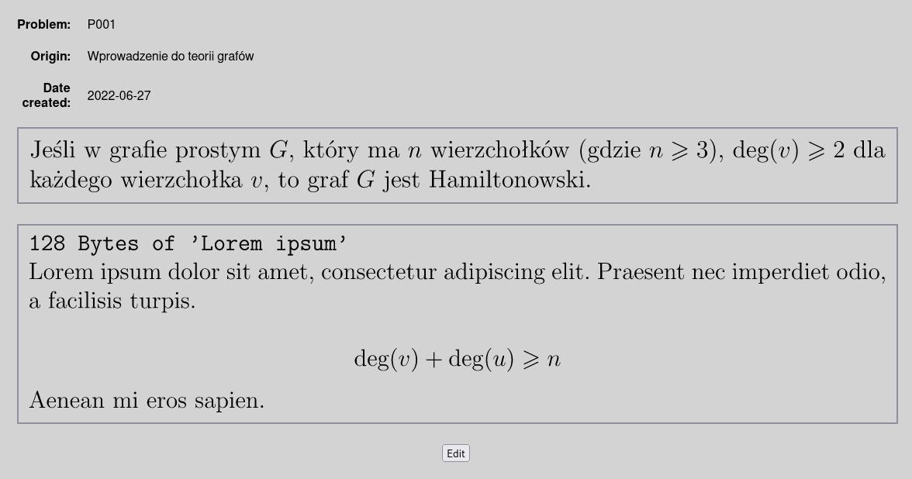

# Problemset

Here some screenshots



## Dependencies

`flask`<br>
`flask-sqlalchemy`<br>
`pdflatex`<br>

## Setting up

It's recommended to setup flask app in python virtual enviroment
```
pip install virtualenv
```
Then create and activate one
```bash
virtualenv venv
source venv/bin/activate
```
And lastly install dependecies using `pip`
```
pip install flask flask-sqlalchemy
```
